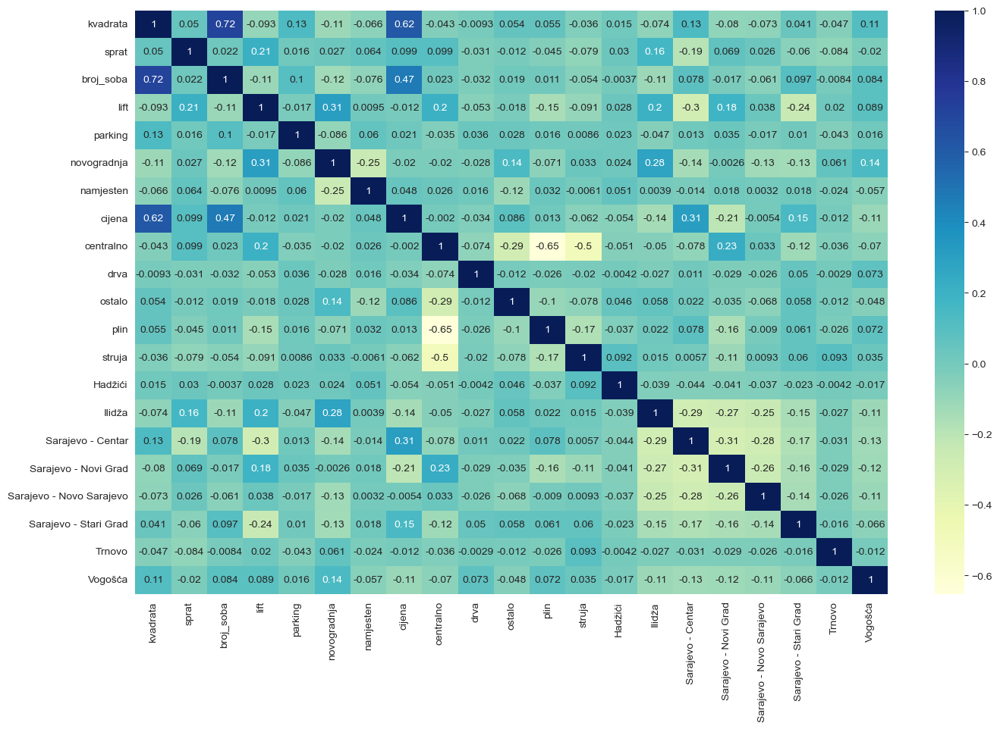
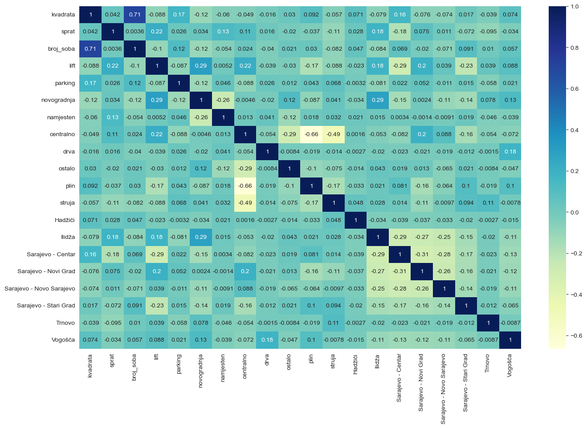
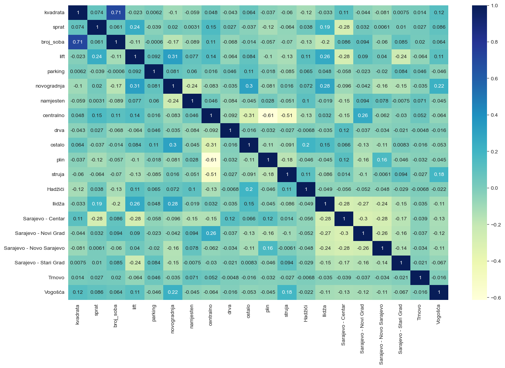
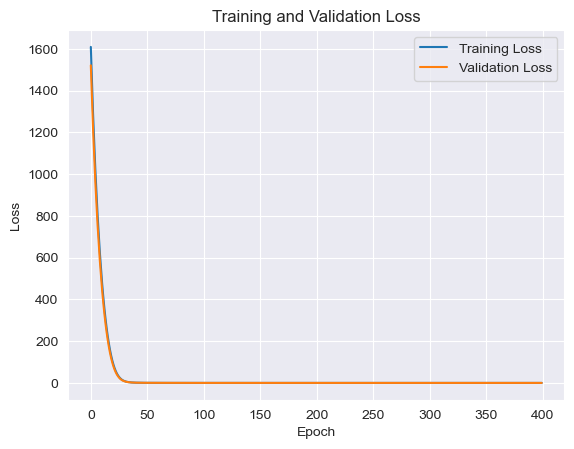

```python
#IMPORTANJE
import numpy as np
import matplotlib.pyplot as plt
import pandas as pd
import seaborn as sns
```


```python
#UCITAVANJE PODATAKA
data = pd.read_csv("zgrade_sarajevo.csv")
# prikaz prvih 10 redova
data.head(100)
```


<div>
<style scoped>
    .dataframe tbody tr th:only-of-type {
        vertical-align: middle;
    }

    .dataframe tbody tr th {
        vertical-align: top;
    }

    .dataframe thead th {
        text-align: right;
    }
</style>
<table border="1" class="dataframe">
  <thead>
    <tr style="text-align: right;">
      <th></th>
      <th>grad</th>
      <th>kvadrata</th>
      <th>sprat</th>
      <th>broj_soba</th>
      <th>vrsta_grijanja</th>
      <th>lift</th>
      <th>parking</th>
      <th>novogradnja</th>
      <th>namjesten</th>
      <th>cijena</th>
    </tr>
  </thead>
  <tbody>
    <tr>
      <th>0</th>
      <td>Sarajevo - Stari Grad</td>
      <td>57.00</td>
      <td>4</td>
      <td>2</td>
      <td>centralno</td>
      <td>0</td>
      <td>0</td>
      <td>0</td>
      <td>2</td>
      <td>342000</td>
    </tr>
    <tr>
      <th>1</th>
      <td>Sarajevo - Novi Grad</td>
      <td>33.00</td>
      <td>5</td>
      <td>0</td>
      <td>centralno</td>
      <td>1</td>
      <td>1</td>
      <td>1</td>
      <td>1</td>
      <td>198000</td>
    </tr>
    <tr>
      <th>2</th>
      <td>Sarajevo - Novo Sarajevo</td>
      <td>55.35</td>
      <td>2</td>
      <td>2</td>
      <td>centralno</td>
      <td>1</td>
      <td>0</td>
      <td>0</td>
      <td>2</td>
      <td>325000</td>
    </tr>
    <tr>
      <th>3</th>
      <td>Ilidža</td>
      <td>42.00</td>
      <td>6</td>
      <td>2</td>
      <td>ostalo</td>
      <td>1</td>
      <td>0</td>
      <td>1</td>
      <td>2</td>
      <td>243600</td>
    </tr>
    <tr>
      <th>4</th>
      <td>Ilidža</td>
      <td>42.00</td>
      <td>2</td>
      <td>1.5</td>
      <td>struja</td>
      <td>1</td>
      <td>1</td>
      <td>1</td>
      <td>2</td>
      <td>242960</td>
    </tr>
    <tr>
      <th>...</th>
      <td>...</td>
      <td>...</td>
      <td>...</td>
      <td>...</td>
      <td>...</td>
      <td>...</td>
      <td>...</td>
      <td>...</td>
      <td>...</td>
      <td>...</td>
    </tr>
    <tr>
      <th>95</th>
      <td>Sarajevo - Centar</td>
      <td>63.00</td>
      <td>2</td>
      <td>3</td>
      <td>plin</td>
      <td>1</td>
      <td>1</td>
      <td>0</td>
      <td>2</td>
      <td>299000</td>
    </tr>
    <tr>
      <th>96</th>
      <td>Sarajevo - Novi Grad</td>
      <td>59.00</td>
      <td>2</td>
      <td>3</td>
      <td>centralno</td>
      <td>1</td>
      <td>1</td>
      <td>0</td>
      <td>2</td>
      <td>280000</td>
    </tr>
    <tr>
      <th>97</th>
      <td>Ilidža</td>
      <td>51.25</td>
      <td>5</td>
      <td>2</td>
      <td>centralno</td>
      <td>1</td>
      <td>1</td>
      <td>1</td>
      <td>2</td>
      <td>243150</td>
    </tr>
    <tr>
      <th>98</th>
      <td>Ilidža</td>
      <td>76.00</td>
      <td>2</td>
      <td>3</td>
      <td>centralno</td>
      <td>1</td>
      <td>1</td>
      <td>0</td>
      <td>2</td>
      <td>360000</td>
    </tr>
    <tr>
      <th>99</th>
      <td>Sarajevo - Centar</td>
      <td>73.94</td>
      <td>1</td>
      <td>3</td>
      <td>plin</td>
      <td>0</td>
      <td>0</td>
      <td>0</td>
      <td>1</td>
      <td>350000</td>
    </tr>
  </tbody>
</table>
<p>100 rows × 10 columns</p>
</div>


Prvo ćemo uraditi OneHot encoding na gradove i vrste grijanja jer su mi to jedine kategoričke varijable.


```python
#SREDIVANJE KATEGORICKIH VARIJABLI
heating_status = pd.get_dummies(data['vrsta_grijanja'])
data = pd.concat([data, heating_status], axis = 1)
data.drop(['vrsta_grijanja'], axis = 1, inplace = True)

cities_status = pd.get_dummies(data['grad'])
data = pd.concat([data, cities_status], axis = 1)
data.drop(['grad'], axis = 1, inplace = True)
```

Za spratove, pošto mnoge instance u datasetu imaju "prizemlje", "visoko", "suteren" kao sprati pošto sam poslije sa provjerom vidio da je sprat apsolutno nebitan kada se odnosi sa cijenom,
samo je bitno da li je na nekom spratu ili je neka od "prizemlje", "visoko", "suteren", ako je neka od ove tri inače je niža cijena pa stavio sam da mi je sprat 1 ako je sprat a inače da je 0


```python
#PRETVARANJE U BROJEVE
def sprat_map(x):
    if x in ["prizemlje", "suteren", "visoko"]:
        return 0
    if x == "20+":
        return 20
    return x


def soba_map(x):
    if x == "četverosoban":
        return 4
    return float(x)


data["sprat"] = data["sprat"].apply(sprat_map)
data["broj_soba"] = data["broj_soba"].apply(soba_map)
```

Pošto sam za mnoge zgrade vidio da nemaju naznaku za lift, ako je na primjer neboder onda sam za zgrade sa više od 4 sprata stavio da ima lift.


```python
#POSTAVLJANJE LIFTA NA TRUE AKO JE BROJ SPRATOVA VECI OD 4
data['sprat'] = pd.to_numeric(data['sprat'])
data.loc[data['sprat'] > 4, 'lift'] = 1
def poboljsanje(x):
    if x == 0:
        return 0
    return 1

data["sprat"] = data["sprat"].apply(poboljsanje)
data.head(100)

```


<div>
<style scoped>
    .dataframe tbody tr th:only-of-type {
        vertical-align: middle;
    }

    .dataframe tbody tr th {
        vertical-align: top;
    }

    .dataframe thead th {
        text-align: right;
    }
</style>
<table border="1" class="dataframe">
  <thead>
    <tr style="text-align: right;">
      <th></th>
      <th>kvadrata</th>
      <th>sprat</th>
      <th>broj_soba</th>
      <th>lift</th>
      <th>parking</th>
      <th>novogradnja</th>
      <th>namjesten</th>
      <th>cijena</th>
      <th>centralno</th>
      <th>drva</th>
      <th>...</th>
      <th>plin</th>
      <th>struja</th>
      <th>Hadžići</th>
      <th>Ilidža</th>
      <th>Sarajevo - Centar</th>
      <th>Sarajevo - Novi Grad</th>
      <th>Sarajevo - Novo Sarajevo</th>
      <th>Sarajevo - Stari Grad</th>
      <th>Trnovo</th>
      <th>Vogošća</th>
    </tr>
  </thead>
  <tbody>
    <tr>
      <th>0</th>
      <td>57.00</td>
      <td>1</td>
      <td>2.0</td>
      <td>0</td>
      <td>0</td>
      <td>0</td>
      <td>2</td>
      <td>342000</td>
      <td>1</td>
      <td>0</td>
      <td>...</td>
      <td>0</td>
      <td>0</td>
      <td>0</td>
      <td>0</td>
      <td>0</td>
      <td>0</td>
      <td>0</td>
      <td>1</td>
      <td>0</td>
      <td>0</td>
    </tr>
    <tr>
      <th>1</th>
      <td>33.00</td>
      <td>1</td>
      <td>0.0</td>
      <td>1</td>
      <td>1</td>
      <td>1</td>
      <td>1</td>
      <td>198000</td>
      <td>1</td>
      <td>0</td>
      <td>...</td>
      <td>0</td>
      <td>0</td>
      <td>0</td>
      <td>0</td>
      <td>0</td>
      <td>1</td>
      <td>0</td>
      <td>0</td>
      <td>0</td>
      <td>0</td>
    </tr>
    <tr>
      <th>2</th>
      <td>55.35</td>
      <td>1</td>
      <td>2.0</td>
      <td>1</td>
      <td>0</td>
      <td>0</td>
      <td>2</td>
      <td>325000</td>
      <td>1</td>
      <td>0</td>
      <td>...</td>
      <td>0</td>
      <td>0</td>
      <td>0</td>
      <td>0</td>
      <td>0</td>
      <td>0</td>
      <td>1</td>
      <td>0</td>
      <td>0</td>
      <td>0</td>
    </tr>
    <tr>
      <th>3</th>
      <td>42.00</td>
      <td>1</td>
      <td>2.0</td>
      <td>1</td>
      <td>0</td>
      <td>1</td>
      <td>2</td>
      <td>243600</td>
      <td>0</td>
      <td>0</td>
      <td>...</td>
      <td>0</td>
      <td>0</td>
      <td>0</td>
      <td>1</td>
      <td>0</td>
      <td>0</td>
      <td>0</td>
      <td>0</td>
      <td>0</td>
      <td>0</td>
    </tr>
    <tr>
      <th>4</th>
      <td>42.00</td>
      <td>1</td>
      <td>1.5</td>
      <td>1</td>
      <td>1</td>
      <td>1</td>
      <td>2</td>
      <td>242960</td>
      <td>0</td>
      <td>0</td>
      <td>...</td>
      <td>0</td>
      <td>1</td>
      <td>0</td>
      <td>1</td>
      <td>0</td>
      <td>0</td>
      <td>0</td>
      <td>0</td>
      <td>0</td>
      <td>0</td>
    </tr>
    <tr>
      <th>...</th>
      <td>...</td>
      <td>...</td>
      <td>...</td>
      <td>...</td>
      <td>...</td>
      <td>...</td>
      <td>...</td>
      <td>...</td>
      <td>...</td>
      <td>...</td>
      <td>...</td>
      <td>...</td>
      <td>...</td>
      <td>...</td>
      <td>...</td>
      <td>...</td>
      <td>...</td>
      <td>...</td>
      <td>...</td>
      <td>...</td>
      <td>...</td>
    </tr>
    <tr>
      <th>95</th>
      <td>63.00</td>
      <td>1</td>
      <td>3.0</td>
      <td>1</td>
      <td>1</td>
      <td>0</td>
      <td>2</td>
      <td>299000</td>
      <td>0</td>
      <td>0</td>
      <td>...</td>
      <td>1</td>
      <td>0</td>
      <td>0</td>
      <td>0</td>
      <td>1</td>
      <td>0</td>
      <td>0</td>
      <td>0</td>
      <td>0</td>
      <td>0</td>
    </tr>
    <tr>
      <th>96</th>
      <td>59.00</td>
      <td>1</td>
      <td>3.0</td>
      <td>1</td>
      <td>1</td>
      <td>0</td>
      <td>2</td>
      <td>280000</td>
      <td>1</td>
      <td>0</td>
      <td>...</td>
      <td>0</td>
      <td>0</td>
      <td>0</td>
      <td>0</td>
      <td>0</td>
      <td>1</td>
      <td>0</td>
      <td>0</td>
      <td>0</td>
      <td>0</td>
    </tr>
    <tr>
      <th>97</th>
      <td>51.25</td>
      <td>1</td>
      <td>2.0</td>
      <td>1</td>
      <td>1</td>
      <td>1</td>
      <td>2</td>
      <td>243150</td>
      <td>1</td>
      <td>0</td>
      <td>...</td>
      <td>0</td>
      <td>0</td>
      <td>0</td>
      <td>1</td>
      <td>0</td>
      <td>0</td>
      <td>0</td>
      <td>0</td>
      <td>0</td>
      <td>0</td>
    </tr>
    <tr>
      <th>98</th>
      <td>76.00</td>
      <td>1</td>
      <td>3.0</td>
      <td>1</td>
      <td>1</td>
      <td>0</td>
      <td>2</td>
      <td>360000</td>
      <td>1</td>
      <td>0</td>
      <td>...</td>
      <td>0</td>
      <td>0</td>
      <td>0</td>
      <td>1</td>
      <td>0</td>
      <td>0</td>
      <td>0</td>
      <td>0</td>
      <td>0</td>
      <td>0</td>
    </tr>
    <tr>
      <th>99</th>
      <td>73.94</td>
      <td>1</td>
      <td>3.0</td>
      <td>0</td>
      <td>0</td>
      <td>0</td>
      <td>1</td>
      <td>350000</td>
      <td>0</td>
      <td>0</td>
      <td>...</td>
      <td>1</td>
      <td>0</td>
      <td>0</td>
      <td>0</td>
      <td>1</td>
      <td>0</td>
      <td>0</td>
      <td>0</td>
      <td>0</td>
      <td>0</td>
    </tr>
  </tbody>
</table>
<p>100 rows × 21 columns</p>
</div>


Vidimo da sve sem parkinga i lifta poprilično utječe na cijenu ali i dalje i parking i lift dovoljno utječu da se razmatraju.


```python
plt.figure(figsize = (16, 10))
sns.heatmap(data.corr(), annot = True, cmap="YlGnBu")
plt.show()
```


    

    


Ovdje sam radio split na trening, test i validation, ali split je morao biti takav da za svaki dio Sarajeva posebno uradim split (pošto ilijaš ima samo 2 stana na OLX morao sam ga ukloniti iz dataseta).
Taj split je 0.8 na trening_i_validaciju, 0.2 na test i onda trening_i_validaciju splitam na 0.8 za trening a 0.2 za validaciju.


```python
import pandas as pd
from sklearn.model_selection import train_test_split

train_data = []
test_data = []
valid_data=[]
Y_valid=[]
Y_train = []
Y_test = []

gradovi=['Vogošća', 'Sarajevo - Stari Grad', 'Ilidža', 'Sarajevo - Novi Grad',
           'Sarajevo - Centar', 'Sarajevo - Novo Sarajevo', 'Trnovo', 'Ilijaš', 'Hadžići']

for grad in data.columns:
    if grad in gradovi:
        grad_data = data[data[grad] == 1]

        X_city = grad_data.drop('cijena', axis=1)
        y_city = grad_data['cijena']
        X_train_and_valid_city, X_test_city, Y_train_and_valid_grad, Y_test_grad = train_test_split(
            X_city, y_city,
            test_size=0.2,
            random_state=42
        )

        print(X_train_and_valid_city.shape)
        print(grad)

        X_train_city, X_valid_city, Y_train_grad, Y_valid_grad = train_test_split(
            X_train_and_valid_city, Y_train_and_valid_grad,
            test_size=0.2,
            random_state=42
        )

        train_data.append(X_train_city)
        test_data.append(X_test_city)
        valid_data.append(X_valid_city)
        Y_valid.append(Y_valid_grad)
        Y_train.append(Y_train_grad)
        Y_test.append(Y_test_grad)

X_train = pd.concat(train_data)
X_test = pd.concat(test_data)
X_valid = pd.concat(valid_data)
Y_train = pd.concat(Y_train)
Y_test = pd.concat(Y_test)
Y_valid = pd.concat(Y_valid)

```

    (4, 20)
    Hadžići
    (165, 20)
    Ilidža
    (200, 20)
    Sarajevo - Centar
    (183, 20)
    Sarajevo - Novi Grad
    (156, 20)
    Sarajevo - Novo Sarajevo
    (66, 20)
    Sarajevo - Stari Grad
    (2, 20)
    Trnovo
    (38, 20)
    Vogošća
    

Ovdje provjeravam da su veoma slične korelacije izmešu trening i testnog skupa.


```python
plt.figure(figsize = (16, 10))
sns.heatmap(X_train.corr(), annot = True, cmap="YlGnBu")
plt.show()
```


    

    


```python
plt.figure(figsize = (16, 10))
sns.heatmap(X_test.corr(), annot = True, cmap="YlGnBu")
plt.show()
```


    

    


Ovdje vidimo da su trening i test splitovi veoma slični


```python
from scipy import stats
print(stats.describe(pd.to_numeric(Y_train)))
print(stats.describe(pd.to_numeric(Y_test)))
```

    DescribeResult(nobs=648, minmax=(150000, 399900), mean=251090.9398148148, variance=4365594630.928366, skewness=0.45646967674069766, kurtosis=-0.7633281077118523)
    DescribeResult(nobs=209, minmax=(151500, 399999), mean=248200.58851674641, variance=4426977436.1856365, skewness=0.44326581607368165, kurtosis=-0.947340522869379)
    

Ovdje proširim testni dataset, povečam ga 5 puta, pokušavao sam i više i manje ali ovaj broj mi daje najbolji rezultat za linearnu regresiju pa mislim da zbog toga
najbolje predstavlja dataset.


```python
#Proširivanje dataseta
X_train = np.array(X_train)
Y_train = np.array(Y_train)

for i in range(len(X_train)):
    cjena_po_kvadratu = Y_train[i]/X_train[i][0]
    for j in range(-2, 4):
        if j != 0:
            nova_zgrada = X_train[i].copy()
            nova_zgrada[0] += j
            nova_cjena = nova_zgrada[0] * cjena_po_kvadratu
            X_train = np.concatenate((X_train, [nova_zgrada]))
            Y_train = np.concatenate((Y_train, [nova_cjena]))


X_test = X_test.values
Y_test = Y_test.values
Y_valid = Y_valid.values
X_valid = np.array(X_valid)


```

Primjetio sam da mi je neuralna mreža bila nerealno dobra, pa sam provjeravao kakav mi je split i primjetio sam da ovom generacijom generišem oko 100 instanci koje su iste kao u testnom skupu
pa njih uklonim.


```python
brojac = 0
index = []
for i in range(len(X_train)):
    for j in range(len(X_test)):
        isti = True
        for k in range(20):
            if X_train[i][k] != X_test[j][k]:
                isti = False
        if isti:
            brojac += 1
            index.append(i)

print(brojac)
```

    105
    


```python
X_train = np.delete(X_train, index, axis =0)
Y_train = np.delete(Y_train, index, axis =0)
print(X_train, X_train.shape)
```

    [[ 80.     1.     3.   ...   0.     0.     0.  ]
     [ 78.     1.     3.   ...   0.     0.     0.  ]
     [114.     1.     4.   ...   0.     0.     0.  ]
     ...
     [ 67.78   1.     3.   ...   0.     0.     1.  ]
     [ 68.78   1.     3.   ...   0.     0.     1.  ]
     [ 69.78   1.     3.   ...   0.     0.     1.  ]] (3783, 20)
    

Sada se uvjerim da nema istih


```python
brojac = 0
index = []
for i in range(len(X_train)):
    for j in range(len(X_test)):
        isti = True
        for k in range(20):
            if X_train[i][k] != X_test[j][k]:
                isti = False
        if isti:
            brojac += 1
            index.append(i)

print(brojac)
```

    0
    

Koristio sam oba skejlara i primjetio da je minmaxScaler bolji pa njega koristim.


```python
from sklearn.preprocessing import StandardScaler
from sklearn.preprocessing import MinMaxScaler

train_std_scaler = StandardScaler()
X_train_std = train_std_scaler.fit_transform(X_train)
X_test_std = train_std_scaler.transform(X_test)

train_minmax_scaler = MinMaxScaler()
train_minmax_scaler = train_minmax_scaler.fit(X_train)
X_train_minmax = train_minmax_scaler.transform(X_train)
X_test_minmax = train_minmax_scaler.transform(X_test)
X_valid_minmax= train_minmax_scaler.transform(X_valid)


train_minmax_scaler = MinMaxScaler()
train_minmax_scaler.fit(Y_train.reshape(-1,1))
Y_train_minmax = train_minmax_scaler.transform(Y_train.reshape(-1,1))
Y_test_minmax = train_minmax_scaler.transform(Y_test.reshape(-1,1))
Y_valid_minmax = train_minmax_scaler.transform(Y_valid.reshape(-1,1))


```

Vidimo da obična linearna regresija daje fenomenalan rezultat


```python
from sklearn.linear_model import LinearRegression
lin_reg = LinearRegression()
lin_reg.fit(X_train_minmax, Y_train_minmax)
```


<style>#sk-container-id-1 {color: black;background-color: white;}#sk-container-id-1 pre{padding: 0;}#sk-container-id-1 div.sk-toggleable {background-color: white;}#sk-container-id-1 label.sk-toggleable__label {cursor: pointer;display: block;width: 100%;margin-bottom: 0;padding: 0.3em;box-sizing: border-box;text-align: center;}#sk-container-id-1 label.sk-toggleable__label-arrow:before {content: "▸";float: left;margin-right: 0.25em;color: #696969;}#sk-container-id-1 label.sk-toggleable__label-arrow:hover:before {color: black;}#sk-container-id-1 div.sk-estimator:hover label.sk-toggleable__label-arrow:before {color: black;}#sk-container-id-1 div.sk-toggleable__content {max-height: 0;max-width: 0;overflow: hidden;text-align: left;background-color: #f0f8ff;}#sk-container-id-1 div.sk-toggleable__content pre {margin: 0.2em;color: black;border-radius: 0.25em;background-color: #f0f8ff;}#sk-container-id-1 input.sk-toggleable__control:checked~div.sk-toggleable__content {max-height: 200px;max-width: 100%;overflow: auto;}#sk-container-id-1 input.sk-toggleable__control:checked~label.sk-toggleable__label-arrow:before {content: "▾";}#sk-container-id-1 div.sk-estimator input.sk-toggleable__control:checked~label.sk-toggleable__label {background-color: #d4ebff;}#sk-container-id-1 div.sk-label input.sk-toggleable__control:checked~label.sk-toggleable__label {background-color: #d4ebff;}#sk-container-id-1 input.sk-hidden--visually {border: 0;clip: rect(1px 1px 1px 1px);clip: rect(1px, 1px, 1px, 1px);height: 1px;margin: -1px;overflow: hidden;padding: 0;position: absolute;width: 1px;}#sk-container-id-1 div.sk-estimator {font-family: monospace;background-color: #f0f8ff;border: 1px dotted black;border-radius: 0.25em;box-sizing: border-box;margin-bottom: 0.5em;}#sk-container-id-1 div.sk-estimator:hover {background-color: #d4ebff;}#sk-container-id-1 div.sk-parallel-item::after {content: "";width: 100%;border-bottom: 1px solid gray;flex-grow: 1;}#sk-container-id-1 div.sk-label:hover label.sk-toggleable__label {background-color: #d4ebff;}#sk-container-id-1 div.sk-serial::before {content: "";position: absolute;border-left: 1px solid gray;box-sizing: border-box;top: 0;bottom: 0;left: 50%;z-index: 0;}#sk-container-id-1 div.sk-serial {display: flex;flex-direction: column;align-items: center;background-color: white;padding-right: 0.2em;padding-left: 0.2em;position: relative;}#sk-container-id-1 div.sk-item {position: relative;z-index: 1;}#sk-container-id-1 div.sk-parallel {display: flex;align-items: stretch;justify-content: center;background-color: white;position: relative;}#sk-container-id-1 div.sk-item::before, #sk-container-id-1 div.sk-parallel-item::before {content: "";position: absolute;border-left: 1px solid gray;box-sizing: border-box;top: 0;bottom: 0;left: 50%;z-index: -1;}#sk-container-id-1 div.sk-parallel-item {display: flex;flex-direction: column;z-index: 1;position: relative;background-color: white;}#sk-container-id-1 div.sk-parallel-item:first-child::after {align-self: flex-end;width: 50%;}#sk-container-id-1 div.sk-parallel-item:last-child::after {align-self: flex-start;width: 50%;}#sk-container-id-1 div.sk-parallel-item:only-child::after {width: 0;}#sk-container-id-1 div.sk-dashed-wrapped {border: 1px dashed gray;margin: 0 0.4em 0.5em 0.4em;box-sizing: border-box;padding-bottom: 0.4em;background-color: white;}#sk-container-id-1 div.sk-label label {font-family: monospace;font-weight: bold;display: inline-block;line-height: 1.2em;}#sk-container-id-1 div.sk-label-container {text-align: center;}#sk-container-id-1 div.sk-container {/* jupyter's `normalize.less` sets `[hidden] { display: none; }` but bootstrap.min.css set `[hidden] { display: none !important; }` so we also need the `!important` here to be able to override the default hidden behavior on the sphinx rendered scikit-learn.org. See: https://github.com/scikit-learn/scikit-learn/issues/21755 */display: inline-block !important;position: relative;}#sk-container-id-1 div.sk-text-repr-fallback {display: none;}</style><div id="sk-container-id-1" class="sk-top-container"><div class="sk-text-repr-fallback"><pre>LinearRegression()</pre><b>In a Jupyter environment, please rerun this cell to show the HTML representation or trust the notebook. <br />On GitHub, the HTML representation is unable to render, please try loading this page with nbviewer.org.</b></div><div class="sk-container" hidden><div class="sk-item"><div class="sk-estimator sk-toggleable"><input class="sk-toggleable__control sk-hidden--visually" id="sk-estimator-id-1" type="checkbox" checked><label for="sk-estimator-id-1" class="sk-toggleable__label sk-toggleable__label-arrow">LinearRegression</label><div class="sk-toggleable__content"><pre>LinearRegression()</pre></div></div></div></div></div>


```python
from sklearn.metrics import mean_absolute_error
Y_train_pred = train_minmax_scaler.inverse_transform(lin_reg.predict(X_train_minmax))
print(mean_absolute_error(Y_train, Y_train_pred))
Y_test_pred = train_minmax_scaler.inverse_transform(lin_reg.predict(X_test_minmax))
print(mean_absolute_error(Y_test, Y_test_pred))
```

    33756.85911278818
    32540.88985046214
    

Ova neuralna mreža daje dobar rezultat, prvo postavim težine na nasumične vrijednost, zatim koristim regularzaciju L2, pokušao sam Dropout ali mi to uporpasti
mrežu, previše generalizira mreža i onda slabija bude od linearne regresije. Na izlazu moram koristi sigmoid jer su mi sve vrjednosti od 0 do 1 a ako koristim RELU
za aktivacijsku funckiju zakonvergira odma tako što sve vrjednosti stavi na 1. Pa sam svugdje za aktivacijsku funkciju koristio RELU. Da bi još malo poboljšo mrežu
smanjujem learning rate kada zaglavi u učenju i dobijem solidan rezultat.


```python
from keras.callbacks import ReduceLROnPlateau
import tensorflow as tf


alpha = 0.0001
reduce_lr = ReduceLROnPlateau(monitor='val_loss', factor=0.2,
                              patience=5, min_lr=1e-12)
init = tf.keras.initializers.RandomUniform(minval=-0.5, maxval=0.5, seed=42)
neuralna_mreza = tf.keras.models.Sequential([
    tf.keras.layers.Dense(500, input_shape=(20,), kernel_initializer=init, activation="sigmoid", kernel_regularizer=tf.keras.regularizers.L2(alpha)),
    tf.keras.layers.Dense(500, kernel_initializer=init, activation="sigmoid", kernel_regularizer=tf.keras.regularizers.L2(alpha)),
    tf.keras.layers.Dense(500, kernel_initializer=init, activation="sigmoid", kernel_regularizer=tf.keras.regularizers.L2(alpha)),
    tf.keras.layers.Dense(1,activation="sigmoid"),
])

neuralna_mreza.compile(optimizer='adam',
              loss=tf.keras.losses.mean_absolute_error,
              metrics=['accuracy'])

history = neuralna_mreza.fit(X_train_minmax, Y_train_minmax, batch_size=10, epochs=400, validation_data=(X_valid_minmax, Y_valid_minmax), callbacks=[reduce_lr])


```
    379/379 [==============================] - 1s 2ms/step - loss: 0.1361 - accuracy: 5.2868e-04 - val_loss: 0.1658 - val_accuracy: 0.0000e+00 - lr: 1.0000e-12
    Epoch 399/400
    379/379 [==============================] - 1s 2ms/step - loss: 0.1361 - accuracy: 5.2868e-04 - val_loss: 0.1658 - val_accuracy: 0.0000e+00 - lr: 1.0000e-12
    Epoch 400/400
    379/379 [==============================] - 1s 2ms/step - loss: 0.1361 - accuracy: 5.2868e-04 - val_loss: 0.1658 - val_accuracy: 0.0000e+00 - lr: 1.0000e-12

```python
from sklearn.metrics import mean_absolute_error
Y_train_pred = train_minmax_scaler.inverse_transform(neuralna_mreza.predict(X_train_minmax))
print(mean_absolute_error(Y_train, Y_train_pred))
Y_test_pred = train_minmax_scaler.inverse_transform(neuralna_mreza.predict(X_test_minmax))
print(mean_absolute_error(Y_test, Y_test_pred))
print("Predikcija: ", 100 - round((mean_absolute_error(Y_test, Y_test_pred))/Y_test.mean() * 100, 4), "%" )
```

    119/119 [==============================] - 0s 612us/step
    23170.2294760336
    7/7 [==============================] - 0s 833us/step
    26391.047772129186
    Predikcija:  89.367 %
    


```python
plt.plot(history.history["loss"], label='Training Loss')
plt.plot(history.history["val_loss"], label='Validation Loss')
plt.xlabel('Epoch')
plt.ylabel('Loss')
plt.title('Training and Validation Loss')
plt.legend()
plt.show()
```


    

    

