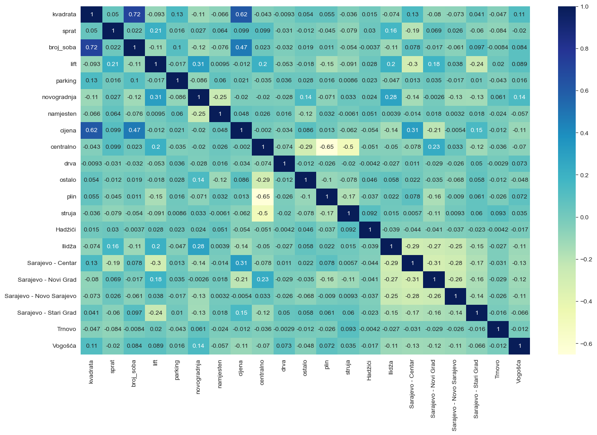
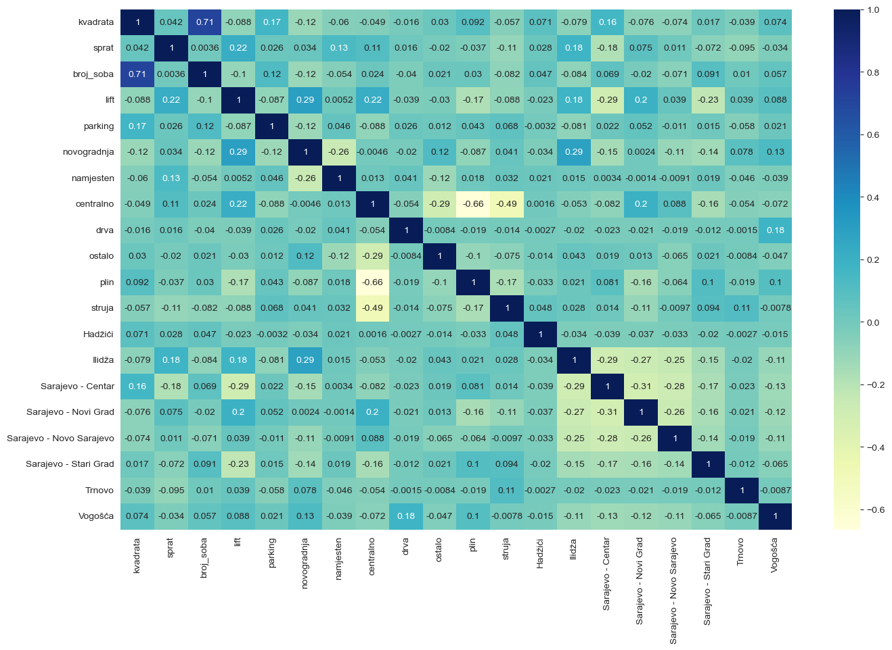
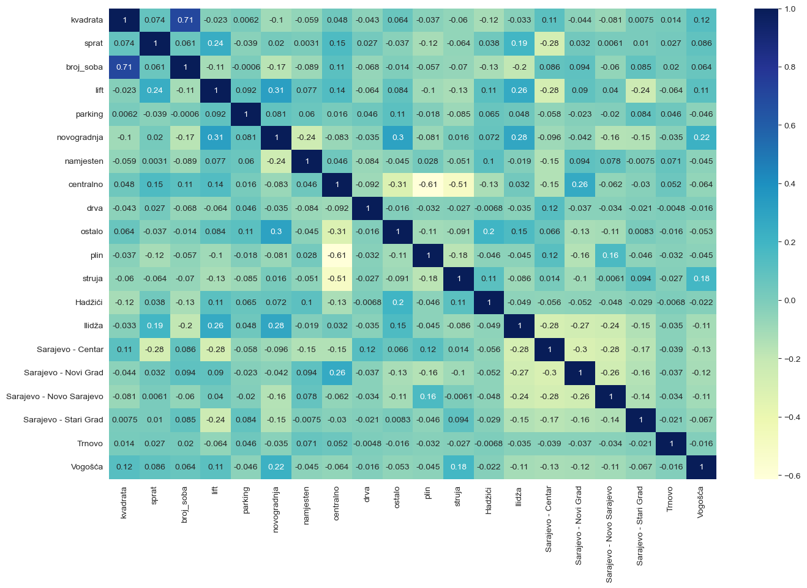
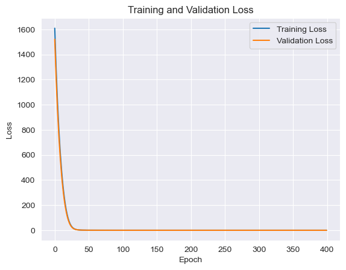

```python
#IMPORTANJE
import numpy as np
import matplotlib.pyplot as plt
import pandas as pd
import seaborn as sns
```


```python
#UCITAVANJE PODATAKA
data = pd.read_csv("zgrade_sarajevo.csv")
# prikaz prvih 10 redova
data.head(100)
```


<div>
<style scoped>
    .dataframe tbody tr th:only-of-type {
        vertical-align: middle;
    }

    .dataframe tbody tr th {
        vertical-align: top;
    }

    .dataframe thead th {
        text-align: right;
    }
</style>
<table border="1" class="dataframe">
  <thead>
    <tr style="text-align: right;">
      <th></th>
      <th>grad</th>
      <th>kvadrata</th>
      <th>sprat</th>
      <th>broj_soba</th>
      <th>vrsta_grijanja</th>
      <th>lift</th>
      <th>parking</th>
      <th>novogradnja</th>
      <th>namjesten</th>
      <th>cijena</th>
    </tr>
  </thead>
  <tbody>
    <tr>
      <th>0</th>
      <td>Sarajevo - Stari Grad</td>
      <td>57.00</td>
      <td>4</td>
      <td>2</td>
      <td>centralno</td>
      <td>0</td>
      <td>0</td>
      <td>0</td>
      <td>2</td>
      <td>342000</td>
    </tr>
    <tr>
      <th>1</th>
      <td>Sarajevo - Novi Grad</td>
      <td>33.00</td>
      <td>5</td>
      <td>0</td>
      <td>centralno</td>
      <td>1</td>
      <td>1</td>
      <td>1</td>
      <td>1</td>
      <td>198000</td>
    </tr>
    <tr>
      <th>2</th>
      <td>Sarajevo - Novo Sarajevo</td>
      <td>55.35</td>
      <td>2</td>
      <td>2</td>
      <td>centralno</td>
      <td>1</td>
      <td>0</td>
      <td>0</td>
      <td>2</td>
      <td>325000</td>
    </tr>
    <tr>
      <th>3</th>
      <td>Ilidža</td>
      <td>42.00</td>
      <td>6</td>
      <td>2</td>
      <td>ostalo</td>
      <td>1</td>
      <td>0</td>
      <td>1</td>
      <td>2</td>
      <td>243600</td>
    </tr>
    <tr>
      <th>4</th>
      <td>Ilidža</td>
      <td>42.00</td>
      <td>2</td>
      <td>1.5</td>
      <td>struja</td>
      <td>1</td>
      <td>1</td>
      <td>1</td>
      <td>2</td>
      <td>242960</td>
    </tr>
    <tr>
      <th>...</th>
      <td>...</td>
      <td>...</td>
      <td>...</td>
      <td>...</td>
      <td>...</td>
      <td>...</td>
      <td>...</td>
      <td>...</td>
      <td>...</td>
      <td>...</td>
    </tr>
    <tr>
      <th>95</th>
      <td>Sarajevo - Centar</td>
      <td>63.00</td>
      <td>2</td>
      <td>3</td>
      <td>plin</td>
      <td>1</td>
      <td>1</td>
      <td>0</td>
      <td>2</td>
      <td>299000</td>
    </tr>
    <tr>
      <th>96</th>
      <td>Sarajevo - Novi Grad</td>
      <td>59.00</td>
      <td>2</td>
      <td>3</td>
      <td>centralno</td>
      <td>1</td>
      <td>1</td>
      <td>0</td>
      <td>2</td>
      <td>280000</td>
    </tr>
    <tr>
      <th>97</th>
      <td>Ilidža</td>
      <td>51.25</td>
      <td>5</td>
      <td>2</td>
      <td>centralno</td>
      <td>1</td>
      <td>1</td>
      <td>1</td>
      <td>2</td>
      <td>243150</td>
    </tr>
    <tr>
      <th>98</th>
      <td>Ilidža</td>
      <td>76.00</td>
      <td>2</td>
      <td>3</td>
      <td>centralno</td>
      <td>1</td>
      <td>1</td>
      <td>0</td>
      <td>2</td>
      <td>360000</td>
    </tr>
    <tr>
      <th>99</th>
      <td>Sarajevo - Centar</td>
      <td>73.94</td>
      <td>1</td>
      <td>3</td>
      <td>plin</td>
      <td>0</td>
      <td>0</td>
      <td>0</td>
      <td>1</td>
      <td>350000</td>
    </tr>
  </tbody>
</table>
<p>100 rows × 10 columns</p>
</div>


Prvo ćemo uraditi OneHot encoding na gradove i vrste grijanja jer su mi to jedine kategoričke varijable.


```python
#SREDIVANJE KATEGORICKIH VARIJABLI
heating_status = pd.get_dummies(data['vrsta_grijanja'])
data = pd.concat([data, heating_status], axis = 1)
data.drop(['vrsta_grijanja'], axis = 1, inplace = True)

cities_status = pd.get_dummies(data['grad'])
data = pd.concat([data, cities_status], axis = 1)
data.drop(['grad'], axis = 1, inplace = True)
```

Za spratove, pošto mnoge instance u datasetu imaju "prizemlje", "visoko", "suteren" kao sprati pošto sam poslije sa provjerom vidio da je sprat apsolutno nebitan kada se odnosi sa cijenom,
samo je bitno da li je na nekom spratu ili je neka od "prizemlje", "visoko", "suteren", ako je neka od ove tri inače je niža cijena pa stavio sam da mi je sprat 1 ako je sprat a inače da je 0


```python
#PRETVARANJE U BROJEVE
def sprat_map(x):
    if x in ["prizemlje", "suteren", "visoko"]:
        return 0
    if x == "20+":
        return 20
    return x


def soba_map(x):
    if x == "četverosoban":
        return 4
    return float(x)


data["sprat"] = data["sprat"].apply(sprat_map)
data["broj_soba"] = data["broj_soba"].apply(soba_map)
```

Pošto sam za mnoge zgrade vidio da nemaju naznaku za lift, ako je na primjer neboder onda sam za zgrade sa više od 4 sprata stavio da ima lift.


```python
#POSTAVLJANJE LIFTA NA TRUE AKO JE BROJ SPRATOVA VECI OD 4
data['sprat'] = pd.to_numeric(data['sprat'])
data.loc[data['sprat'] > 4, 'lift'] = 1
def poboljsanje(x):
    if x == 0:
        return 0
    return 1

data["sprat"] = data["sprat"].apply(poboljsanje)
data.head(100)

```


<div>
<style scoped>
    .dataframe tbody tr th:only-of-type {
        vertical-align: middle;
    }

    .dataframe tbody tr th {
        vertical-align: top;
    }

    .dataframe thead th {
        text-align: right;
    }
</style>
<table border="1" class="dataframe">
  <thead>
    <tr style="text-align: right;">
      <th></th>
      <th>kvadrata</th>
      <th>sprat</th>
      <th>broj_soba</th>
      <th>lift</th>
      <th>parking</th>
      <th>novogradnja</th>
      <th>namjesten</th>
      <th>cijena</th>
      <th>centralno</th>
      <th>drva</th>
      <th>...</th>
      <th>plin</th>
      <th>struja</th>
      <th>Hadžići</th>
      <th>Ilidža</th>
      <th>Sarajevo - Centar</th>
      <th>Sarajevo - Novi Grad</th>
      <th>Sarajevo - Novo Sarajevo</th>
      <th>Sarajevo - Stari Grad</th>
      <th>Trnovo</th>
      <th>Vogošća</th>
    </tr>
  </thead>
  <tbody>
    <tr>
      <th>0</th>
      <td>57.00</td>
      <td>1</td>
      <td>2.0</td>
      <td>0</td>
      <td>0</td>
      <td>0</td>
      <td>2</td>
      <td>342000</td>
      <td>1</td>
      <td>0</td>
      <td>...</td>
      <td>0</td>
      <td>0</td>
      <td>0</td>
      <td>0</td>
      <td>0</td>
      <td>0</td>
      <td>0</td>
      <td>1</td>
      <td>0</td>
      <td>0</td>
    </tr>
    <tr>
      <th>1</th>
      <td>33.00</td>
      <td>1</td>
      <td>0.0</td>
      <td>1</td>
      <td>1</td>
      <td>1</td>
      <td>1</td>
      <td>198000</td>
      <td>1</td>
      <td>0</td>
      <td>...</td>
      <td>0</td>
      <td>0</td>
      <td>0</td>
      <td>0</td>
      <td>0</td>
      <td>1</td>
      <td>0</td>
      <td>0</td>
      <td>0</td>
      <td>0</td>
    </tr>
    <tr>
      <th>2</th>
      <td>55.35</td>
      <td>1</td>
      <td>2.0</td>
      <td>1</td>
      <td>0</td>
      <td>0</td>
      <td>2</td>
      <td>325000</td>
      <td>1</td>
      <td>0</td>
      <td>...</td>
      <td>0</td>
      <td>0</td>
      <td>0</td>
      <td>0</td>
      <td>0</td>
      <td>0</td>
      <td>1</td>
      <td>0</td>
      <td>0</td>
      <td>0</td>
    </tr>
    <tr>
      <th>3</th>
      <td>42.00</td>
      <td>1</td>
      <td>2.0</td>
      <td>1</td>
      <td>0</td>
      <td>1</td>
      <td>2</td>
      <td>243600</td>
      <td>0</td>
      <td>0</td>
      <td>...</td>
      <td>0</td>
      <td>0</td>
      <td>0</td>
      <td>1</td>
      <td>0</td>
      <td>0</td>
      <td>0</td>
      <td>0</td>
      <td>0</td>
      <td>0</td>
    </tr>
    <tr>
      <th>4</th>
      <td>42.00</td>
      <td>1</td>
      <td>1.5</td>
      <td>1</td>
      <td>1</td>
      <td>1</td>
      <td>2</td>
      <td>242960</td>
      <td>0</td>
      <td>0</td>
      <td>...</td>
      <td>0</td>
      <td>1</td>
      <td>0</td>
      <td>1</td>
      <td>0</td>
      <td>0</td>
      <td>0</td>
      <td>0</td>
      <td>0</td>
      <td>0</td>
    </tr>
    <tr>
      <th>...</th>
      <td>...</td>
      <td>...</td>
      <td>...</td>
      <td>...</td>
      <td>...</td>
      <td>...</td>
      <td>...</td>
      <td>...</td>
      <td>...</td>
      <td>...</td>
      <td>...</td>
      <td>...</td>
      <td>...</td>
      <td>...</td>
      <td>...</td>
      <td>...</td>
      <td>...</td>
      <td>...</td>
      <td>...</td>
      <td>...</td>
      <td>...</td>
    </tr>
    <tr>
      <th>95</th>
      <td>63.00</td>
      <td>1</td>
      <td>3.0</td>
      <td>1</td>
      <td>1</td>
      <td>0</td>
      <td>2</td>
      <td>299000</td>
      <td>0</td>
      <td>0</td>
      <td>...</td>
      <td>1</td>
      <td>0</td>
      <td>0</td>
      <td>0</td>
      <td>1</td>
      <td>0</td>
      <td>0</td>
      <td>0</td>
      <td>0</td>
      <td>0</td>
    </tr>
    <tr>
      <th>96</th>
      <td>59.00</td>
      <td>1</td>
      <td>3.0</td>
      <td>1</td>
      <td>1</td>
      <td>0</td>
      <td>2</td>
      <td>280000</td>
      <td>1</td>
      <td>0</td>
      <td>...</td>
      <td>0</td>
      <td>0</td>
      <td>0</td>
      <td>0</td>
      <td>0</td>
      <td>1</td>
      <td>0</td>
      <td>0</td>
      <td>0</td>
      <td>0</td>
    </tr>
    <tr>
      <th>97</th>
      <td>51.25</td>
      <td>1</td>
      <td>2.0</td>
      <td>1</td>
      <td>1</td>
      <td>1</td>
      <td>2</td>
      <td>243150</td>
      <td>1</td>
      <td>0</td>
      <td>...</td>
      <td>0</td>
      <td>0</td>
      <td>0</td>
      <td>1</td>
      <td>0</td>
      <td>0</td>
      <td>0</td>
      <td>0</td>
      <td>0</td>
      <td>0</td>
    </tr>
    <tr>
      <th>98</th>
      <td>76.00</td>
      <td>1</td>
      <td>3.0</td>
      <td>1</td>
      <td>1</td>
      <td>0</td>
      <td>2</td>
      <td>360000</td>
      <td>1</td>
      <td>0</td>
      <td>...</td>
      <td>0</td>
      <td>0</td>
      <td>0</td>
      <td>1</td>
      <td>0</td>
      <td>0</td>
      <td>0</td>
      <td>0</td>
      <td>0</td>
      <td>0</td>
    </tr>
    <tr>
      <th>99</th>
      <td>73.94</td>
      <td>1</td>
      <td>3.0</td>
      <td>0</td>
      <td>0</td>
      <td>0</td>
      <td>1</td>
      <td>350000</td>
      <td>0</td>
      <td>0</td>
      <td>...</td>
      <td>1</td>
      <td>0</td>
      <td>0</td>
      <td>0</td>
      <td>1</td>
      <td>0</td>
      <td>0</td>
      <td>0</td>
      <td>0</td>
      <td>0</td>
    </tr>
  </tbody>
</table>
<p>100 rows × 21 columns</p>
</div>


Vidimo da sve sem parkinga i lifta poprilično utječe na cijenu ali i dalje i parking i lift dovoljno utječu da se razmatraju.


```python
plt.figure(figsize = (16, 10))
sns.heatmap(data.corr(), annot = True, cmap="YlGnBu")
plt.show()
```


    

    


Ovdje sam radio split na trening, test i validation, ali split je morao biti takav da za svaki dio Sarajeva posebno uradim split (pošto ilijaš ima samo 2 stana na OLX morao sam ga ukloniti iz dataseta).
Taj split je 0.8 na trening_i_validaciju, 0.2 na test i onda trening_i_validaciju splitam na 0.8 za trening a 0.2 za validaciju.


```python
import pandas as pd
from sklearn.model_selection import train_test_split

train_data = []
test_data = []
valid_data=[]
Y_valid=[]
Y_train = []
Y_test = []

gradovi=['Vogošća', 'Sarajevo - Stari Grad', 'Ilidža', 'Sarajevo - Novi Grad',
           'Sarajevo - Centar', 'Sarajevo - Novo Sarajevo', 'Trnovo', 'Ilijaš', 'Hadžići']

for grad in data.columns:
    if grad in gradovi:
        grad_data = data[data[grad] == 1]

        X_city = grad_data.drop('cijena', axis=1)
        y_city = grad_data['cijena']
        X_train_and_valid_city, X_test_city, Y_train_and_valid_grad, Y_test_grad = train_test_split(
            X_city, y_city,
            test_size=0.2,
            random_state=42
        )

        print(X_train_and_valid_city.shape)
        print(grad)

        X_train_city, X_valid_city, Y_train_grad, Y_valid_grad = train_test_split(
            X_train_and_valid_city, Y_train_and_valid_grad,
            test_size=0.2,
            random_state=42
        )

        train_data.append(X_train_city)
        test_data.append(X_test_city)
        valid_data.append(X_valid_city)
        Y_valid.append(Y_valid_grad)
        Y_train.append(Y_train_grad)
        Y_test.append(Y_test_grad)

X_train = pd.concat(train_data)
X_test = pd.concat(test_data)
X_valid = pd.concat(valid_data)
Y_train = pd.concat(Y_train)
Y_test = pd.concat(Y_test)
Y_valid = pd.concat(Y_valid)

```

    (4, 20)
    Hadžići
    (165, 20)
    Ilidža
    (200, 20)
    Sarajevo - Centar
    (183, 20)
    Sarajevo - Novi Grad
    (156, 20)
    Sarajevo - Novo Sarajevo
    (66, 20)
    Sarajevo - Stari Grad
    (2, 20)
    Trnovo
    (38, 20)
    Vogošća
    

Ovdje provjeravam da su veoma slične korelacije izmešu trening i testnog skupa.


```python
plt.figure(figsize = (16, 10))
sns.heatmap(X_train.corr(), annot = True, cmap="YlGnBu")
plt.show()
```


    

    


```python
plt.figure(figsize = (16, 10))
sns.heatmap(X_test.corr(), annot = True, cmap="YlGnBu")
plt.show()
```


    

    


Ovdje vidimo da su trening i test splitovi veoma slični


```python
from scipy import stats
print(stats.describe(pd.to_numeric(Y_train)))
print(stats.describe(pd.to_numeric(Y_test)))
```

    DescribeResult(nobs=648, minmax=(150000, 399900), mean=251090.9398148148, variance=4365594630.928366, skewness=0.45646967674069766, kurtosis=-0.7633281077118523)
    DescribeResult(nobs=209, minmax=(151500, 399999), mean=248200.58851674641, variance=4426977436.1856365, skewness=0.44326581607368165, kurtosis=-0.947340522869379)
    

Ovdje proširim testni dataset, povečam ga 5 puta, pokušavao sam i više i manje ali ovaj broj mi daje najbolji rezultat za linearnu regresiju pa mislim da zbog toga
najbolje predstavlja dataset.


```python
#Proširivanje dataseta
X_train = np.array(X_train)
Y_train = np.array(Y_train)

for i in range(len(X_train)):
    cjena_po_kvadratu = Y_train[i]/X_train[i][0]
    for j in range(-2, 4):
        if j != 0:
            nova_zgrada = X_train[i].copy()
            nova_zgrada[0] += j
            nova_cjena = nova_zgrada[0] * cjena_po_kvadratu
            X_train = np.concatenate((X_train, [nova_zgrada]))
            Y_train = np.concatenate((Y_train, [nova_cjena]))


X_test = X_test.values
Y_test = Y_test.values
Y_valid = Y_valid.values
X_valid = np.array(X_valid)


```

Primjetio sam da mi je neuralna mreža bila nerealno dobra, pa sam provjeravao kakav mi je split i primjetio sam da ovom generacijom generišem oko 100 instanci koje su iste kao u testnom skupu
pa njih uklonim.


```python
brojac = 0
index = []
for i in range(len(X_train)):
    for j in range(len(X_test)):
        isti = True
        for k in range(20):
            if X_train[i][k] != X_test[j][k]:
                isti = False
        if isti:
            brojac += 1
            index.append(i)

print(brojac)
```

    81
    


```python
X_train = np.delete(X_train, index, axis =0)
Y_train = np.delete(Y_train, index, axis =0)
print(X_train, X_train.shape)
```

    [[ 80.     1.     3.   ...   0.     0.     0.  ]
     [ 78.     1.     3.   ...   0.     0.     0.  ]
     [114.     1.     4.   ...   0.     0.     0.  ]
     ...
     [ 68.78   1.     3.   ...   0.     0.     1.  ]
     [ 69.78   1.     3.   ...   0.     0.     1.  ]
     [ 70.78   1.     3.   ...   0.     0.     1.  ]] (3807, 20)
    

Sada se uvjerim da nema istih


```python
brojac = 0
index = []
for i in range(len(X_train)):
    for j in range(len(X_test)):
        isti = True
        for k in range(20):
            if X_train[i][k] != X_test[j][k]:
                isti = False
        if isti:
            brojac += 1
            index.append(i)

print(brojac)
```

    0
    

Koristio sam oba skejlara i primjetio da je minmaxScaler bolji pa njega koristim.


```python
kvadrati_train = X_train[:, 0]
kvadrati_valid = X_valid[:, 0]
kvadrati_test = X_test[:, 0]
X_train = np.delete(X_train, 0, axis=1)
X_valid = np.delete(X_valid, 0, axis=1)
X_test = np.delete(X_test, 0, axis=1)
```


```python
for i in range(len(Y_train)):
    Y_train[i] = Y_train[i] / kvadrati_train[i]

for i in range(len(Y_test)):
    Y_test[i] = Y_test[i] / kvadrati_test[i]

for i in range(len(Y_valid)):
    Y_valid[i] = Y_valid[i] / kvadrati_valid[i]

print(Y_test, Y_train, Y_valid)
```

    [3367 3367 3000 4650 3571 3452 2974 4744 3432 3214 4533 3100 2910 4324
     3050 2078 3271 2321 3000 2559 3500 3565 3274 2918 3397 3421 3633 4385
     3456 4543 3184 2650 3070 3636 3655 3311 3108 3440 3200 2960 4000 3350
     3678 2857 3673 5410 3608 4444 3973 3456 3255 2518 5317 3934 3533 3112
     3088 3793 4375 3035 3277 5100 3928 4918 2701 5012 3958 4357 3521 4653
     4500 5208 4800 2943 2881 4733 3082 3277 4915 3870 5012 4305 3831 4197
     3932 4013 4222 4166 3333 5096 4074 3883 3485 4700 3547 2298 3763 5263
     2628 4900 2528 4363 2597 2985 3173 2368 4666 3413 2767 2202 3098 3012
     4193 2105 2712 3298 2910 2500 2739 3174 4700 3000 3395 3320 3538 2555
     3802 3225 4000 4745 3169 2934 3220 3561 3037 3455 2847 3046 3679 3272
     3280 3333 3636 4872 4019 3000 2528 4054 4154 4705 2812 3000 4903 2938
     4111 3602 3615 3241 5245 4029 2420 3646 3875 3333 4285 3911 4062 3409
     2763 4500 4056 3943 3555 2567 4545 3333 3867 4154 4687 3514 4017 4409
     6000 4687 4397 4828 4444 5156 3705 5384 5147 3762 4338 3000 4324 2974
     3868 2550 4561 2642 2336 2645 2246 2718 2424 2943 2784 3155 2657] [2687.5        2000.         2500.         ... 2999.98524639 2999.98524639
     2999.98524639] [3175 3952 2208 3911 4499 3985 3541 2592 3184 3397 5784 3269 4000 3039
     3163 4300 3445 2149 3000 3500 5056 3698 3755 3761 2380 3183 2008 4000
     3200 3737 4658 3000 2884 2163 3854 3779 5465 3390 4201 3636 4000 2666
     4702 3994 5475 4000 4065 4722 3230 5576 3969 4500 5196 4603 3333 3650
     3824 4416 5581 4897 3254 4232 2988 3548 4013 4337 4673 3533 3000 3883
     4196 3000 4561 3571 4255 2720 2671 3876 3818 2700 3846 3802 3584 2835
     4500 3881 4519 3200 3405 2532 2818 4300 5409 4000 3148 2467 2511 2600
     3450 3510 2890 3201 4519 2467 2038 3615 5306 2844 4107 3051 2008 2720
     3588 3535 3965 4800 3228 4177 3403 3750 3395 4201 4328 3500 4117 2984
     3216 2105 4485 4918 3997 2580 2790 3369 2916 2567 3882 4400 5000 2300
     3023 3000 2100 5769 3348 3000 3571 5384 2938 2068 4015 3732 4190 3750
     3933 4583 3214 3995 3013 2631 2524 2171 2800 2722 2803 2317]
    


```python
from sklearn.preprocessing import StandardScaler
from sklearn.preprocessing import MinMaxScaler

train_std_scaler = StandardScaler()
X_train_std = train_std_scaler.fit_transform(X_train)
X_test_std = train_std_scaler.transform(X_test)

train_minmax_scaler = MinMaxScaler()
train_minmax_scaler = train_minmax_scaler.fit(X_train)
X_train_minmax = train_minmax_scaler.transform(X_train)
X_test_minmax = train_minmax_scaler.transform(X_test)
X_valid_minmax= train_minmax_scaler.transform(X_valid)


train_minmax_scaler = MinMaxScaler()
train_minmax_scaler.fit(Y_train.reshape(-1,1))
Y_train_minmax = train_minmax_scaler.transform(Y_train.reshape(-1,1))
Y_test_minmax = train_minmax_scaler.transform(Y_test.reshape(-1,1))
Y_valid_minmax = train_minmax_scaler.transform(Y_valid.reshape(-1,1))


```

Vidimo da obična linearna regresija daje fenomenalan rezultat


```python
from sklearn.linear_model import LinearRegression
lin_reg = LinearRegression()
lin_reg.fit(X_train_minmax, Y_train_minmax)
```


<style>#sk-container-id-1 {color: black;background-color: white;}#sk-container-id-1 pre{padding: 0;}#sk-container-id-1 div.sk-toggleable {background-color: white;}#sk-container-id-1 label.sk-toggleable__label {cursor: pointer;display: block;width: 100%;margin-bottom: 0;padding: 0.3em;box-sizing: border-box;text-align: center;}#sk-container-id-1 label.sk-toggleable__label-arrow:before {content: "▸";float: left;margin-right: 0.25em;color: #696969;}#sk-container-id-1 label.sk-toggleable__label-arrow:hover:before {color: black;}#sk-container-id-1 div.sk-estimator:hover label.sk-toggleable__label-arrow:before {color: black;}#sk-container-id-1 div.sk-toggleable__content {max-height: 0;max-width: 0;overflow: hidden;text-align: left;background-color: #f0f8ff;}#sk-container-id-1 div.sk-toggleable__content pre {margin: 0.2em;color: black;border-radius: 0.25em;background-color: #f0f8ff;}#sk-container-id-1 input.sk-toggleable__control:checked~div.sk-toggleable__content {max-height: 200px;max-width: 100%;overflow: auto;}#sk-container-id-1 input.sk-toggleable__control:checked~label.sk-toggleable__label-arrow:before {content: "▾";}#sk-container-id-1 div.sk-estimator input.sk-toggleable__control:checked~label.sk-toggleable__label {background-color: #d4ebff;}#sk-container-id-1 div.sk-label input.sk-toggleable__control:checked~label.sk-toggleable__label {background-color: #d4ebff;}#sk-container-id-1 input.sk-hidden--visually {border: 0;clip: rect(1px 1px 1px 1px);clip: rect(1px, 1px, 1px, 1px);height: 1px;margin: -1px;overflow: hidden;padding: 0;position: absolute;width: 1px;}#sk-container-id-1 div.sk-estimator {font-family: monospace;background-color: #f0f8ff;border: 1px dotted black;border-radius: 0.25em;box-sizing: border-box;margin-bottom: 0.5em;}#sk-container-id-1 div.sk-estimator:hover {background-color: #d4ebff;}#sk-container-id-1 div.sk-parallel-item::after {content: "";width: 100%;border-bottom: 1px solid gray;flex-grow: 1;}#sk-container-id-1 div.sk-label:hover label.sk-toggleable__label {background-color: #d4ebff;}#sk-container-id-1 div.sk-serial::before {content: "";position: absolute;border-left: 1px solid gray;box-sizing: border-box;top: 0;bottom: 0;left: 50%;z-index: 0;}#sk-container-id-1 div.sk-serial {display: flex;flex-direction: column;align-items: center;background-color: white;padding-right: 0.2em;padding-left: 0.2em;position: relative;}#sk-container-id-1 div.sk-item {position: relative;z-index: 1;}#sk-container-id-1 div.sk-parallel {display: flex;align-items: stretch;justify-content: center;background-color: white;position: relative;}#sk-container-id-1 div.sk-item::before, #sk-container-id-1 div.sk-parallel-item::before {content: "";position: absolute;border-left: 1px solid gray;box-sizing: border-box;top: 0;bottom: 0;left: 50%;z-index: -1;}#sk-container-id-1 div.sk-parallel-item {display: flex;flex-direction: column;z-index: 1;position: relative;background-color: white;}#sk-container-id-1 div.sk-parallel-item:first-child::after {align-self: flex-end;width: 50%;}#sk-container-id-1 div.sk-parallel-item:last-child::after {align-self: flex-start;width: 50%;}#sk-container-id-1 div.sk-parallel-item:only-child::after {width: 0;}#sk-container-id-1 div.sk-dashed-wrapped {border: 1px dashed gray;margin: 0 0.4em 0.5em 0.4em;box-sizing: border-box;padding-bottom: 0.4em;background-color: white;}#sk-container-id-1 div.sk-label label {font-family: monospace;font-weight: bold;display: inline-block;line-height: 1.2em;}#sk-container-id-1 div.sk-label-container {text-align: center;}#sk-container-id-1 div.sk-container {/* jupyter's `normalize.less` sets `[hidden] { display: none; }` but bootstrap.min.css set `[hidden] { display: none !important; }` so we also need the `!important` here to be able to override the default hidden behavior on the sphinx rendered scikit-learn.org. See: https://github.com/scikit-learn/scikit-learn/issues/21755 */display: inline-block !important;position: relative;}#sk-container-id-1 div.sk-text-repr-fallback {display: none;}</style><div id="sk-container-id-1" class="sk-top-container"><div class="sk-text-repr-fallback"><pre>LinearRegression()</pre><b>In a Jupyter environment, please rerun this cell to show the HTML representation or trust the notebook. <br />On GitHub, the HTML representation is unable to render, please try loading this page with nbviewer.org.</b></div><div class="sk-container" hidden><div class="sk-item"><div class="sk-estimator sk-toggleable"><input class="sk-toggleable__control sk-hidden--visually" id="sk-estimator-id-1" type="checkbox" checked><label for="sk-estimator-id-1" class="sk-toggleable__label sk-toggleable__label-arrow">LinearRegression</label><div class="sk-toggleable__content"><pre>LinearRegression()</pre></div></div></div></div></div>


```python
from sklearn.metrics import mean_absolute_error
Y_train_pred = train_minmax_scaler.inverse_transform(lin_reg.predict(X_train_minmax))
print(mean_absolute_error(Y_train, Y_train_pred))
Y_test_pred = train_minmax_scaler.inverse_transform(lin_reg.predict(X_test_minmax))
print(mean_absolute_error(Y_test, Y_test_pred))
```

    516.1829080370944
    501.80500289697966
    

Ova neuralna mreža daje dobar rezultat, prvo postavim težine na nasumične vrijednost, zatim koristim regularzaciju L2, pokušao sam Dropout ali mi to uporpasti
mrežu, previše generalizira mreža i onda slabija bude od linearne regresije. Na izlazu moram koristi sigmoid jer su mi sve vrjednosti od 0 do 1 a ako koristim RELU
za aktivacijsku funckiju zakonvergira odma tako što sve vrjednosti stavi na 1. Pa sam svugdje za aktivacijsku funkciju koristio RELU. Da bi još malo poboljšo mrežu
smanjujem learning rate kada zaglavi u učenju i dobijem solidan rezultat.


```python
from keras.callbacks import ReduceLROnPlateau
import tensorflow as tf


alpha = 0.0001
reduce_lr = ReduceLROnPlateau(monitor='val_loss', factor=0.2,
                              patience=5, min_lr=1e-12)
init = tf.keras.initializers.RandomUniform(minval=-0.5, maxval=0.5, seed=42)
neuralna_mreza = tf.keras.models.Sequential([
    tf.keras.layers.Dense(500, input_shape=(19,), kernel_initializer=init, activation="sigmoid", kernel_regularizer=tf.keras.regularizers.L2(alpha)),
    tf.keras.layers.Dense(500, kernel_initializer=init, activation="sigmoid", kernel_regularizer=tf.keras.regularizers.L2(alpha)),
    tf.keras.layers.Dense(500, kernel_initializer=init, activation="sigmoid", kernel_regularizer=tf.keras.regularizers.L2(alpha)),
    tf.keras.layers.Dense(1,activation="sigmoid"),
])

neuralna_mreza.compile(optimizer='adam',
              loss=tf.keras.losses.mean_absolute_error,
              metrics=['accuracy'])

history = neuralna_mreza.fit(X_train_minmax, Y_train_minmax, batch_size=10, epochs=400, validation_data=(X_valid_minmax, Y_valid_minmax), callbacks=[reduce_lr])


```
    Epoch 57/400
    381/381 [==============================] - 1s 2ms/step - loss: 0.1380 - accuracy: 0.0032 - val_loss: 0.1458 - val_accuracy: 0.0000e+00 - lr: 2.0000e-04
    Epoch 58/400
    381/381 [==============================] - 1s 2ms/step - loss: 0.1377 - accuracy: 0.0032 - val_loss: 0.1509 - val_accuracy: 0.0000e+00 - lr: 2.0000e-04
    Epoch 59/400
    104/381 [=======>......................] - ETA: 0s - loss: 0.1385 - accuracy: 0.0019

```python
from sklearn.metrics import mean_absolute_error
Y_train_pred = train_minmax_scaler.inverse_transform(neuralna_mreza.predict(X_train_minmax))
print(mean_absolute_error(Y_train, Y_train_pred))
Y_test_pred = train_minmax_scaler.inverse_transform(neuralna_mreza.predict(X_test_minmax))
print(mean_absolute_error(Y_test, Y_test_pred))
print("Predikcija: ", 100 - round((mean_absolute_error(Y_test, Y_test_pred))/Y_test.mean() * 100, 4), "%" )
```

    119/119 [==============================] - 0s 2ms/step
    511.9368943595681
    7/7 [==============================] - 0s 837us/step
    498.03285618832234
    Predikcija:  86.2828 %
    


```python
plt.plot(history.history["loss"], label='Training Loss')
plt.plot(history.history["val_loss"], label='Validation Loss')
plt.xlabel('Epoch')
plt.ylabel('Loss')
plt.title('Training and Validation Loss')
plt.legend()
plt.show()
```


    

    

